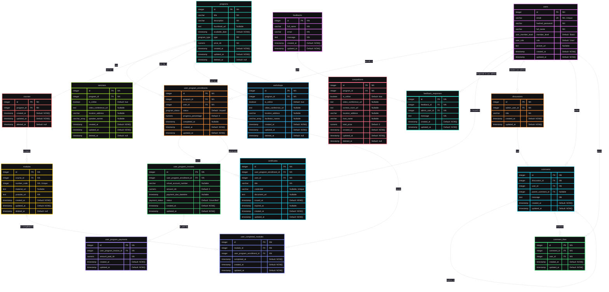

# Project Designs

## Entity Relationship Diagram

```mermaid
---
config:
  theme: redux-dark-color
  layout: dagre
---
erDiagram
    users {
        integer id PK "NN"
        varchar email UK "NN, Unique"
        varchar hashed_password "NN"
        varchar full_name "NN"
        user_member_level member_level "Default: 'Basic'"
        user_role role "Default: 'User'"
        text picture_url "Nullable"
        timestamp created_at "Default: NOW()"
        timestamp updated_at "Default: NOW()"
    }
    programs {
        integer id PK "NN"
        varchar title "NN"
        varchar description "NN"
        text thumbnail_url "Nullable"
        timestamp available_date "Default: NOW()"
        program_type type "NN"
        numeric price_idr "NN"
        timestamp created_at "Default: NOW()"
        timestamp updated_at "Default: NOW()"
        timestamp deleted_at "Default: null"
    }
    user_program_enrollments {
        integer id PK "NN"
        integer program_id FK "NN"
        integer user_id FK "NN"
        program_status status "Default: 'Unpaid'"
        numeric progress_percentage "Default: 0"
        timestamp completed_at "Nullable"
        timestamp created_at "Default: NOW()"
        timestamp updated_at "Default: NOW()"
    }
    certificates {
        integer id PK "NN"
        integer user_program_enrollment_id FK "NN"
        integer user_id FK "NN"
        varchar title "NN"
        varchar credential "Nullable, Unique"
        text document_url "Nullable"
        timestamp issued_at "Default: NOW()"
        timestamp expired_at "Nullable"
        timestamp created_at "Default: NOW()"
        timestamp updated_at "Default: NOW()"
    }
    user_program_invoices {
        integer id PK "NN"
        integer user_program_enrollment_id FK "NN"
        varchar virtual_account_number "Nullable"
        numeric amount_idr "Default: 0"
        timestamp payment_due_datetime "Nullable"
        payment_status status "Default: 'Unverified'"
        timestamp created_at "Default: NOW()"
        timestamp updated_at "Default: NOW()"
    }
    user_program_payments {
        integer id PK "NN"
        integer user_program_invoice_id FK "NN"
        numeric amount_paid_idr "NN"
        timestamp created_at "Default: NOW()"
        timestamp updated_at "Default: NOW()"
    }
    courses {
        integer id PK "NN"
        integer program_id FK "NN"
        timestamp created_at "Default: NOW()"
        timestamp updated_at "Default: NOW()"
        timestamp deleted_at "Default: null"
    }
    modules {
        integer id PK "NN"
        integer course_id FK "NN"
        integer number_code "NN, Unique"
        text material_url "Nullable"
        text youtube_url "NN"
        timestamp created_at "Default: NOW()"
        timestamp updated_at "Default: NOW()"
        timestamp deleted_at "Default: null"
    }
    user_completed_modules {
        integer id PK "NN"
        integer module_id FK "NN"
        integer user_program_enrollment_id FK "NN"
        timestamp completed_at "Default: NOW()"
        timestamp created_at "Default: NOW()"
        timestamp updated_at "Default: NOW()"
    }
    seminars {
        integer id PK "NN"
        integer program_id FK "NN"
        boolean is_online "Default: true"
        text video_conference_url "Nullable"
        varchar location_address "Nullable"
        varchar_array speaker_names "Nullable"
        timestamp created_at "Default: NOW()"
        timestamp updated_at "Default: NOW()"
        timestamp deleted_at "Default: null"
    }
    workshops {
        integer id PK "NN"
        integer program_id FK "NN"
        boolean is_online "Default: true"
        text video_conference_url "Nullable"
        varchar location_address "Nullable"
        varchar_array facilitator_names "Nullable"
        timestamp created_at "Default: NOW()"
        timestamp updated_at "Default: NOW()"
        timestamp deleted_at "Default: null"
    }
    competitions {
        integer id PK "NN"
        integer program_id FK "NN"
        boolean is_online "Default: true"
        text video_conference_url "Nullable"
        text contest_room_url "Nullable"
        varchar location_address "Nullable"
        varchar host_name "Nullable"
        numeric total_prize "Default: 0"
        timestamp created_at "Default: NOW()"
        timestamp updated_at "Default: NOW()"
        timestamp deleted_at "Default: null"
    }
    feedbacks {
        integer id PK "NN"
        varchar full_name "NN"
        varchar email "NN"
        text message "NN"
        timestamp created_at "Default: NOW()"
        timestamp updated_at "Default: NOW()"
    }
    feedback_responses {
        integer id PK "NN"
        integer feedback_id FK "NN"
        integer admin_user_id FK "NN"
        text message "NN"
        timestamp created_at "Default: NOW()"
        timestamp updated_at "Default: NOW()"
    }
    discussions {
        integer id PK "NN"
        integer admin_user_id FK "NN"
        varchar title "NN"
        timestamp created_at "Default: NOW()"
        timestamp updated_at "Default: NOW()"
    }
    comments {
        integer id PK "NN"
        integer discussion_id FK "NN"
        integer user_id FK "NN"
        integer parent_comment_id FK "Nullable"
        text message "NN"
        timestamp created_at "Default: NOW()"
        timestamp updated_at "Default: NOW()"
    }
    comment_likes {
        integer id PK "NN"
        integer comment_id FK "NN"
        integer user_id FK "NN"
        timestamp created_at "Default: NOW()"
        timestamp updated_at "Default: NOW()"
    }
    users ||--o{ user_program_enrollments : "enrolls in"
    programs ||--o{ user_program_enrollments : "has"
    user_program_enrollments ||--o{ certificates : "earns"
    users ||--o{ certificates : "is issued to"
    user_program_enrollments ||--o| user_program_invoices : "generates"
    user_program_invoices ||--o| user_program_payments : "is paid by"
    user_program_enrollments ||--o{ user_completed_modules : "tracks"
    modules ||--o{ user_completed_modules : "is completed in"
    programs ||--o| courses : "can be a"
    courses ||--o{ modules : "contains"
    programs ||--o| seminars : "can be a"
    programs ||--o| workshops : "can be a"
    programs ||--o| competitions : "can be a"
    feedbacks ||--o{ feedback_responses : "gets"
    users ||--o{ feedback_responses : "responds to (as admin)"
    users ||--o{ discussions : "creates (as admin)"
    discussions ||--o{ comments : "has"
    users ||--o{ comments : "writes"
    comments |o--o{ comments : "replies to"
    comments ||--o{ comment_likes : "receives"
    users ||--o{ comment_likes : "gives"
```

## Data Flow Diagram

## Class Diagram

## Docker Architecture Diagram
