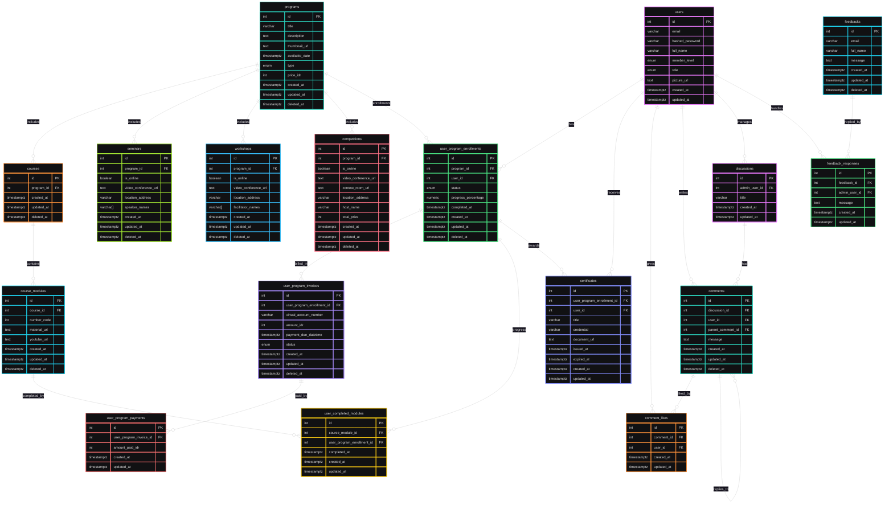
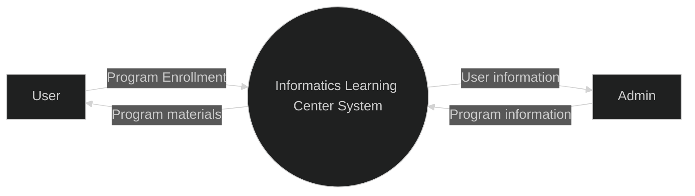
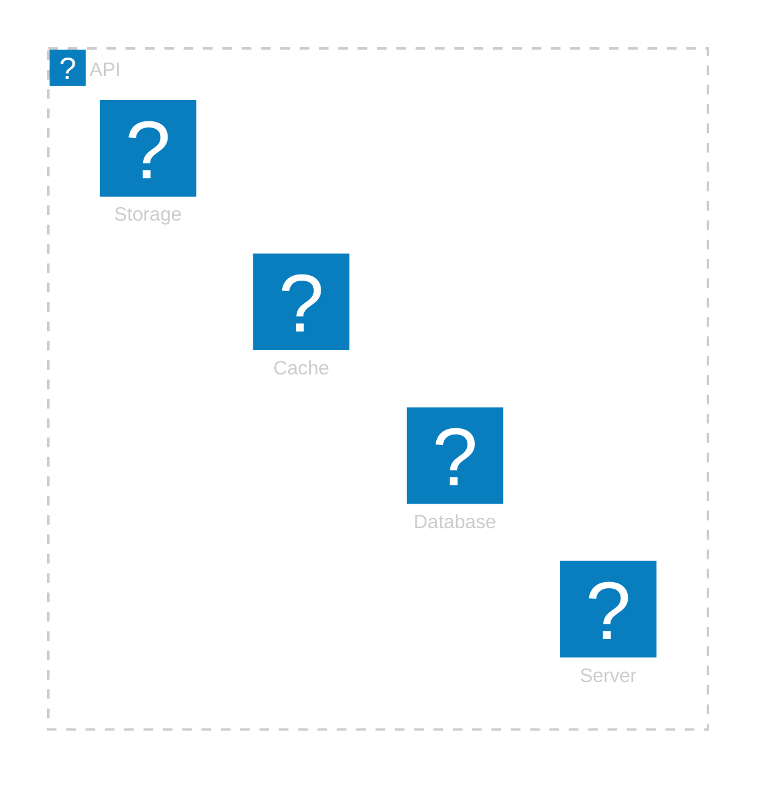

# Project Designs

## Entity Relationship Diagram

```mermaid
---
config:
  theme: redux-dark-color
  layout: dagre
---
erDiagram
    users {
        int id PK
        varchar email
        varchar hashed_password
        varchar full_name
        enum member_level
        enum role
        text picture_url
        timestamptz created_at
        timestamptz updated_at
    }

    programs {
        int id PK
        varchar title
        text description
        text thumbnail_url
        timestamptz available_date
        enum type
        int price_idr
        timestamptz created_at
        timestamptz updated_at
        timestamptz deleted_at
    }

    courses {
        int id PK
        int program_id FK
        timestamptz created_at
        timestamptz updated_at
        timestamptz deleted_at
    }

    course_modules {
        int id PK
        int course_id FK
        int number_code
        text material_url
        text youtube_url
        timestamptz created_at
        timestamptz updated_at
        timestamptz deleted_at
    }

    user_program_enrollments {
        int id PK
        int program_id FK
        int user_id FK
        enum status
        numeric progress_percentage
        timestamptz completed_at
        timestamptz created_at
        timestamptz updated_at
        timestamptz deleted_at
    }

    user_program_invoices {
        int id PK
        int user_program_enrollment_id FK
        varchar virtual_account_number
        int amount_idr
        timestamptz payment_due_datetime
        enum status
        timestamptz created_at
        timestamptz updated_at
        timestamptz deleted_at
    }

    user_program_payments {
        int id PK
        int user_program_invoice_id FK
        int amount_paid_idr
        timestamptz created_at
        timestamptz updated_at
    }

    user_completed_modules {
        int id PK
        int course_module_id FK
        int user_program_enrollment_id FK
        timestamptz completed_at
        timestamptz created_at
        timestamptz updated_at
    }

    certificates {
        int id PK
        int user_program_enrollment_id FK
        int user_id FK
        varchar title
        varchar credential
        text document_url
        timestamptz issued_at
        timestamptz expired_at
        timestamptz created_at
        timestamptz updated_at
    }

    seminars {
        int id PK
        int program_id FK
        boolean is_online
        text video_conference_url
        varchar location_address
        varchar[] speaker_names
        timestamptz created_at
        timestamptz updated_at
        timestamptz deleted_at
    }

    workshops {
        int id PK
        int program_id FK
        boolean is_online
        text video_conference_url
        varchar location_address
        varchar[] facilitator_names
        timestamptz created_at
        timestamptz updated_at
        timestamptz deleted_at
    }

    competitions {
        int id PK
        int program_id FK
        boolean is_online
        text video_conference_url
        text contest_room_url
        varchar location_address
        varchar host_name
        int total_prize
        timestamptz created_at
        timestamptz updated_at
        timestamptz deleted_at
    }

    discussions {
        int id PK
        int admin_user_id FK
        varchar title
        timestamptz created_at
        timestamptz updated_at
    }

    comments {
        int id PK
        int discussion_id FK
        int user_id FK
        int parent_comment_id FK
        text message
        timestamptz created_at
        timestamptz updated_at
        timestamptz deleted_at
    }

    comment_likes {
        int id PK
        int comment_id FK
        int user_id FK
        timestamptz created_at
        timestamptz updated_at
    }

    feedbacks {
        int id PK
        varchar email
        varchar full_name
        text message
        timestamptz created_at
        timestamptz updated_at
        timestamptz deleted_at
    }

    feedback_responses {
        int id PK
        int feedback_id FK
        int admin_user_id FK
        text message
        timestamptz created_at
        timestamptz updated_at
    }

    users ||--o{ user_program_enrollments : has
    users ||--o{ certificates : receives
    users ||--o{ comment_likes : gives
    users ||--o{ comments : writes
    users ||--o{ discussions : manages
    users ||--o{ feedback_responses : handles

    programs ||--o{ courses : includes
    programs ||--o{ seminars : includes
    programs ||--o{ workshops : includes
    programs ||--o{ competitions : includes
    programs ||--o{ user_program_enrollments : enrollments

    courses ||--o{ course_modules : contains
    course_modules ||--o{ user_completed_modules : completed_by

    user_program_enrollments ||--o{ user_program_invoices : billed_in
    user_program_invoices ||--o{ user_program_payments : paid_by
    user_program_enrollments ||--o{ user_completed_modules : progress
    user_program_enrollments ||--o{ certificates : awards

    discussions ||--o{ comments : has
    comments ||--o{ comment_likes : liked_by
    comments ||--o{ comments : replies_to

    feedbacks ||--o{ feedback_responses : replied_by
```

## Data Flow Diagram

### Level 0 (Context-Diagram)

```mermaid
---
config:
  theme: dark
  layout: dagree
---
flowchart LR
    User[User]
    Admin[Admin]
    System((Informatics Learning Center System))

    User --> |Program Enrollment| System
    System --> |Program materials| User
    Admin --> |Program information| System
    System --> |User information| Admin
```

## Architecture Diagram

### Deployment on AWS

```mermaid
---
config:
  theme: dark
  layout: dagree
---
architecture-beta
  group api(logos:aws-ec2)[API]

  service server(logos:aws-ec2)[Server] in api
  service db(logos:aws-rds)[Database] in api
  service cache(logos:aws-elasticache)[Cache] in api
  service storage(logos:aws-s3)[Storage] in api
```

## Class Diagram
